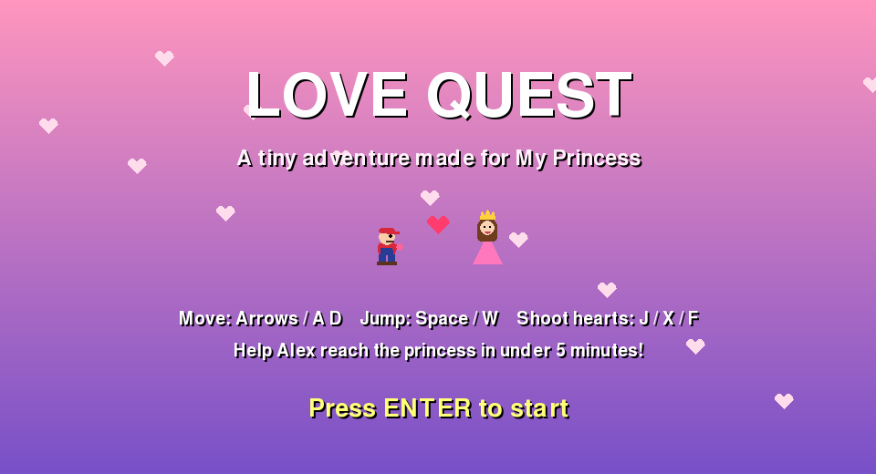

# Love Quest

A tiny 5-minute Mario-style platformer made with love, written in Python with pygame.



## Play in the browser

Once GitHub Pages is on, the game is live at:
`https://<your-username>.github.io/<repo-name>/`

## Play on your computer

```
pip install pygame-ce
python main.py
```

## Controls

| Action | Keys |
|---|---|
| Move | Arrow keys or A / D |
| Jump | Space, W or Up |
| Shoot hearts | J, X or F |
| Start / continue | Enter |

## Personalize

Edit the **PERSONALIZE ME** section at the top of `main.py`: names, colours, the 8 memory messages and the ending lines.

## Worlds

1. The Meadow of First Dates
2. The Cave of Misunderstandings
3. Castle of the Heartbreaker (boss fight)
